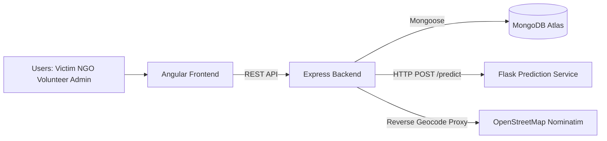

# Disaster Management System (DMS)

A full-stack disaster response platform for managing aid requests, disaster reports, NGO operations, volunteer workflows, regional assignments, distribution shifts, and demand forecasting.

This repository contains three major parts:

- Frontend: Angular 21 application with role-based dashboards
- Backend: Node.js + Express + MongoDB REST API
- Prediction Service: Flask + scikit-learn forecasting service

## Project Goals

- Enable victims to request aid quickly
- Allow NGOs to manage volunteers, inventory, tasks, and shifts
- Support admins with governance and approvals
- Provide map-based visibility for disasters and active distributions
- Forecast aid package demand for assigned regions/disasters

## Architecture



## Repository Structure

```text
90-done-fyp/
  backend/       # Express API, MongoDB models, business logic, utility scripts
  frontend/      # Angular standalone app (role-based dashboards + shared components)
  prediction/    # Flask prediction API + model training assets
  *.md           # Implementation guides, status docs, flow notes
```

## Core Features

### Authentication and Roles

- Signup/Login with JWT-based auth
- Roles: admin, ngo, volunteer, victim
- CNIC-based login flow for victim users
- User status controls (active/inactive/blocked)

### Aid Request Management

- Public/optional-auth aid request submission
- Victim-centric tracking (my requests, status updates)
- NGO-side request viewing and task creation from requests

### Disaster Reporting and Tracking

- Public disaster reporting
- Disaster lifecycle/status management
- Disaster stats endpoint

### NGO Operations

- NGO registration and approval lifecycle
- Inventory management (package/category/quantity based)
- Capacity insights and workload tracking
- Assigned region awareness

### Volunteer Operations

- Volunteer registration and profile
- Verification by NGO/admin
- Availability and region assignment
- Capacity contribution by role/skill/shift profile

### Task and Distribution Workflow

- NGO task creation and assignment
- Volunteer task views and status updates
- Distribution shift creation/assignment/verification
- Distribution logs and active shift operations

### Mapping and Geo Features

- Unified map feed (active disasters + distribution points)
- Reverse geocode proxy for friendly place names

### Forecasting

- Backend endpoint for NGO forecast retrieval
- Multi-day package demand forecast (food, medical, shelter, clothing, water)
- Trend-aware decay and combined multi-disaster forecasting logic

## Tech Stack

### Frontend

- Angular 21 (standalone components)
- Angular Material + CDK
- Leaflet (map rendering)

### Backend

- Node.js + Express
- MongoDB + Mongoose
- JWT + bcryptjs
- CORS + dotenv

### Prediction

- Flask + flask-cors
- scikit-learn
- pandas + numpy

## Prerequisites

- Node.js 20+ recommended
- npm (workspace uses npm)
- Python 3.10+ recommended
- MongoDB Atlas connection string

## Local Setup

## 1) Backend Setup

```bash
cd backend
npm install
```

Create or update backend environment variables in backend/.env:

```env
PORT=5000
NODE_ENV=development
MONGODB_URI=your_mongodb_connection_string
JWT_SECRET=your_secure_secret
JWT_EXPIRE=30d
```

Run backend:

```bash
npm run dev
```

or

```bash
npm start
```

Backend base URL:

- http://localhost:5000/api

Health check:

- GET http://localhost:5000/api/health

## 2) Frontend Setup

```bash
cd frontend
npm install
npm start
```

Frontend URL:

- http://localhost:4200

Important local-dev note:

- frontend/src/environments/environment.ts currently points to a deployed backend URL.
- For full local development, switch apiUrl to:

```ts
apiUrl: 'http://localhost:5000/api'
```

## 3) Prediction Service Setup (Optional for local ML service work)

```bash
cd prediction
python -m venv .venv
.venv\Scripts\activate
pip install -r requirements.txt
python app.py
```

Prediction service default URL:

- http://localhost:8000

Health check:

- GET http://localhost:8000/health

Important integration note:

- Backend prediction controller currently calls a deployed prediction API URL directly.
- If you want backend to use local Flask service, update the prediction service URL in backend/src/controllers/prediction.controller.js.

## Running the Full System Locally

Use three terminals:

1. Terminal A:

```bash
cd backend
npm run dev
```

2. Terminal B:

```bash
cd frontend
npm start
```

3. Terminal C (optional local prediction):

```bash
cd prediction
.venv\Scripts\activate
python app.py
```

## API Surface (High-Level)

Mounted backend route groups:

- /api/auth
- /api/aid-requests
- /api/disasters
- /api/users
- /api/volunteers
- /api/organizations
- /api/region-assignments
- /api/tasks
- /api/distribution
- /api/map
- /api/notifications
- /api/predictions
- /api/admin/stats
- /api/health

Examples:

- POST /api/auth/signup
- POST /api/auth/login
- POST /api/auth/cnic-login
- GET /api/auth/me
- GET /api/organizations/approved/list
- GET /api/map/data
- GET /api/predictions/:orgId

## Utility and Seed Scripts

The backend folder contains helper scripts used during development/testing, including:

- create-admin.js
- seed-organizations.js
- seed-disasters.js
- seed-map-data.js
- create-test-shift.js
- add-test-inventory.js
- create-organization-for-ngo.js

Run as needed from backend:

```bash
node create-admin.js
```

## Troubleshooting

### CORS or auth issues

- Ensure frontend and backend URLs match allowed origins and apiUrl config.
- Confirm Authorization header is present for protected routes.

### 401/403 from protected endpoints

- Verify token validity and user status (active required).
- Check role-based restrictions on each route.

### MongoDB connection failures

- Validate MONGODB_URI in backend/.env.
- Check Atlas network access and database user permissions.

### Forecast endpoint unavailable

- Prediction service may be offline/unreachable.
- If using local prediction service, ensure backend target URL is updated accordingly.


## Security Notes

- Do not commit secrets in backend/.env
- Use strong JWT secrets in non-dev environments
- Restrict CORS origins appropriately for production

## License

ISC (as defined in backend/package.json)
